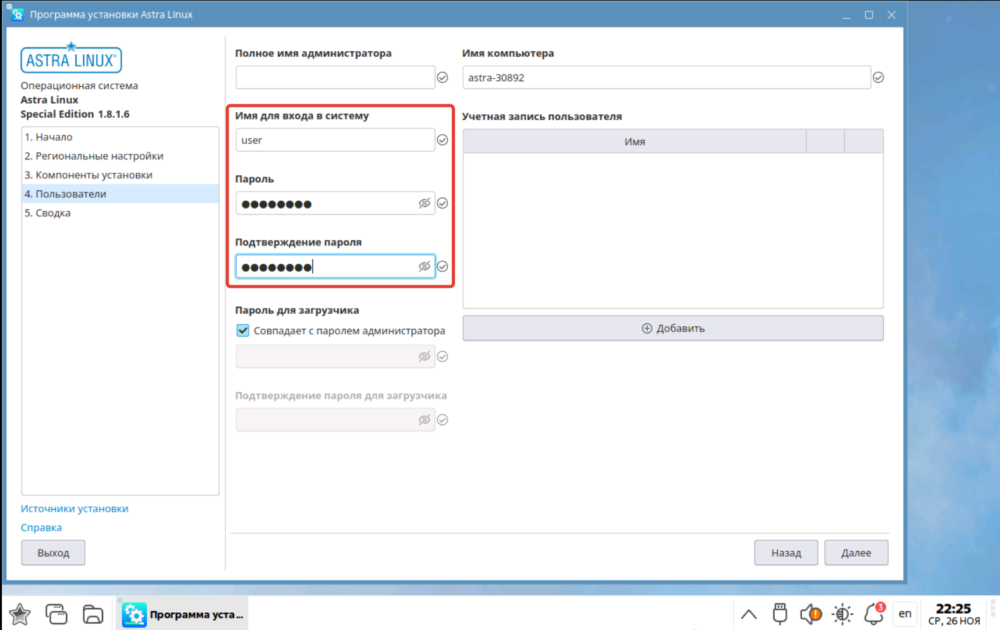
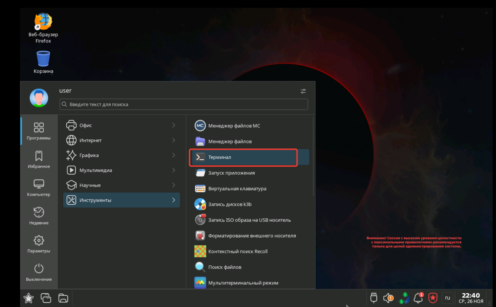
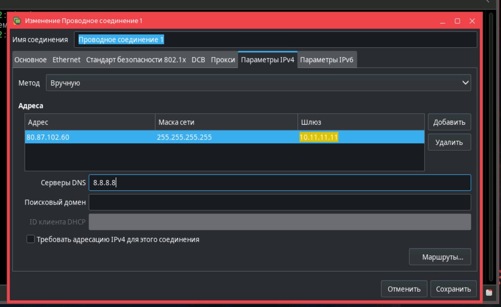

# Установка
* [Скачать ALSE 1.8.1.6](https://disk.yandex.ru/d/4Mc8rgZQUBh0nQ)

* установка из графической среды;

* для удобства добавляем ssh;

* задаем пароль и не забываем его и имя пользователя;

* ход установки;

* терминал запускается так;

* настройка сети;

* настройка сети;
