# Установка и настройка 1С

## Загрузка и установка дистрибутивов

* скачиваем deb-пакеты;
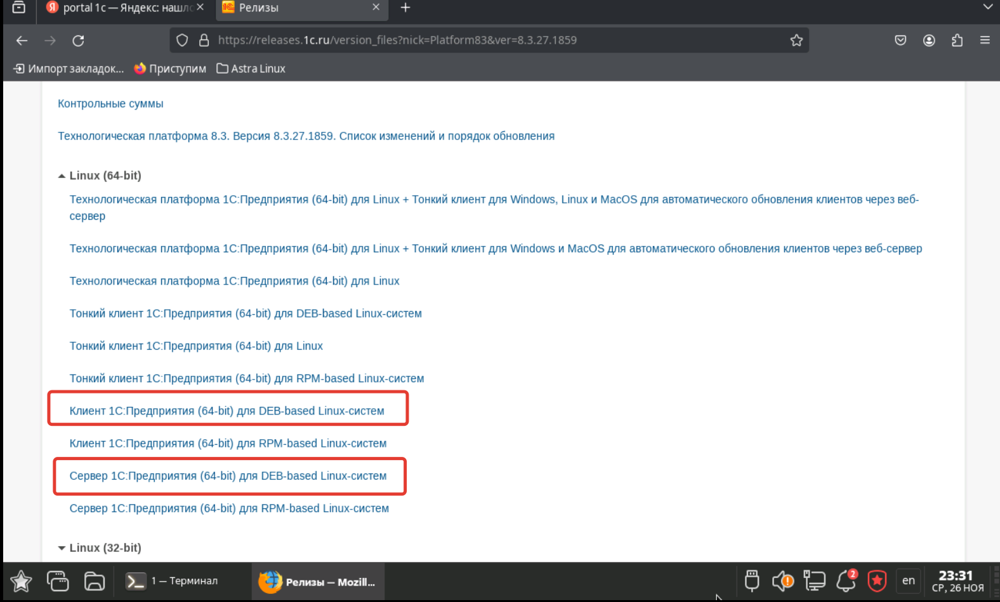

* скачиваем deb-пакеты;


* устанавливаем deb-пакеты сервера;


* устанавливаем deb-пакеты клиента;


## Настройка клиента 1С

* запускаем клиент и пробуем создать файловую базу;


* создаем ярлык 1С для удобства;
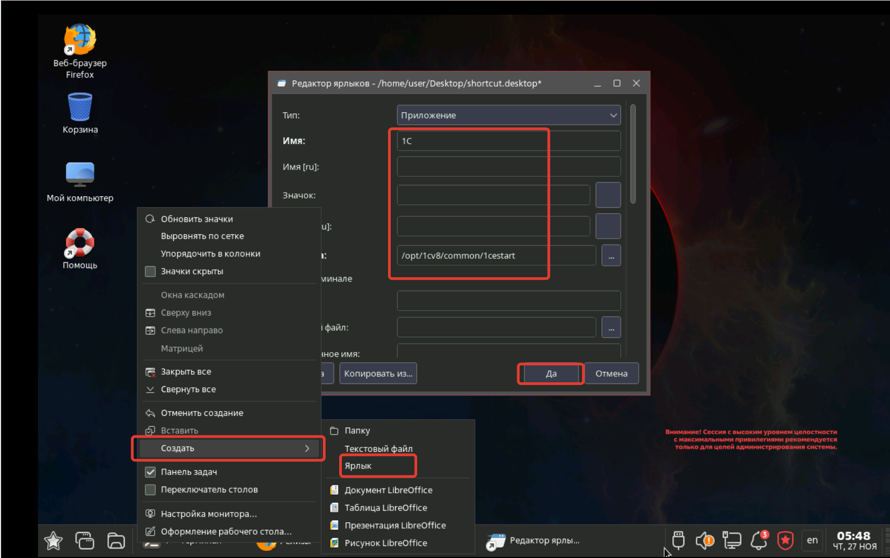

## Настройка сервера 1С

* прописываем службу сервера 1С;
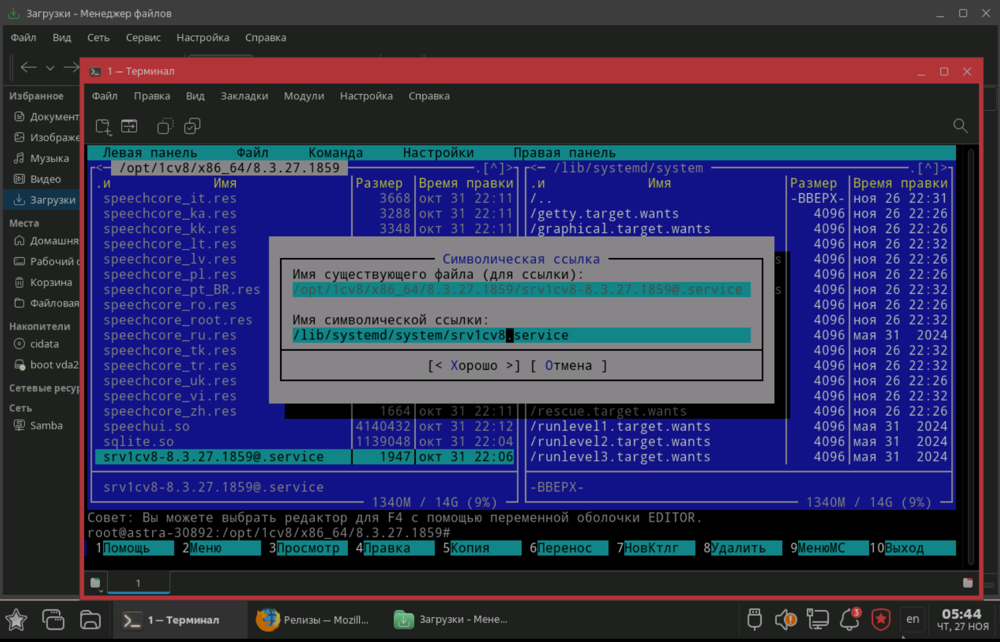

* запускаем и проверяем службу сервера 1С;


* проверяем работу сервера;
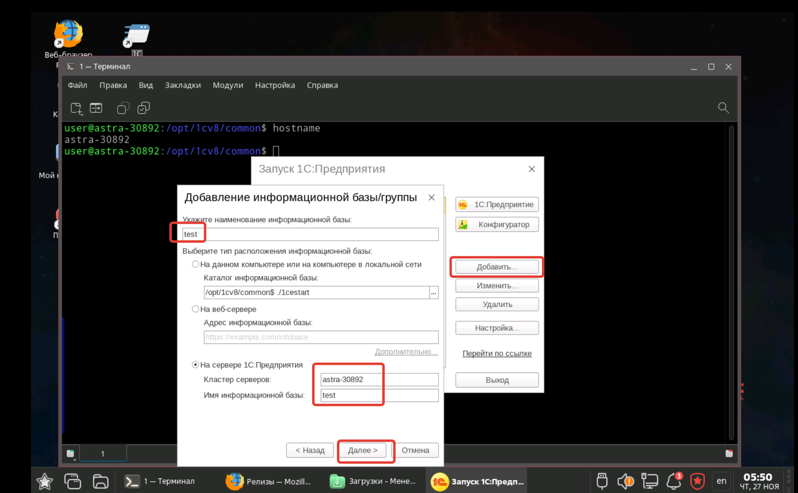

* это значит, что сервер работает;
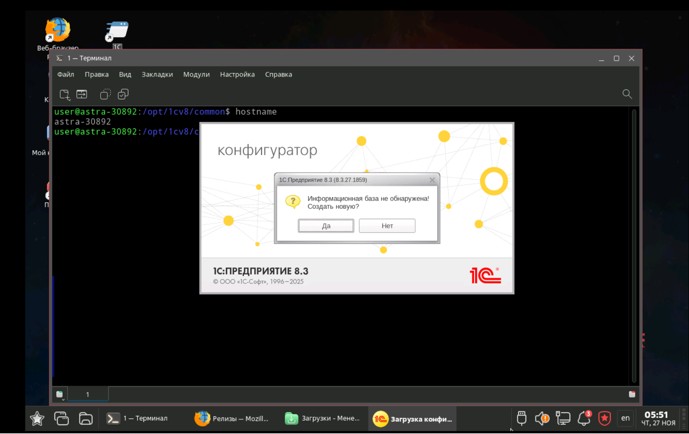

* есть возможноть управлять сервером через интерфейс 1С;
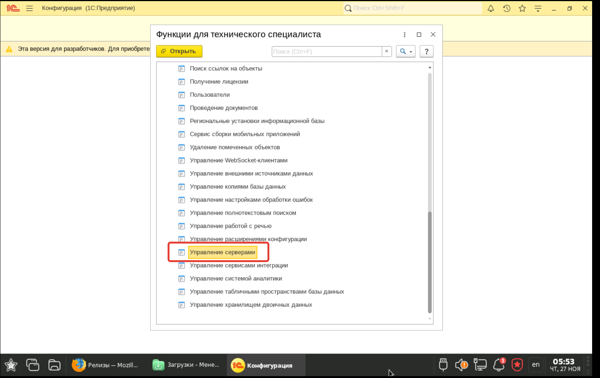

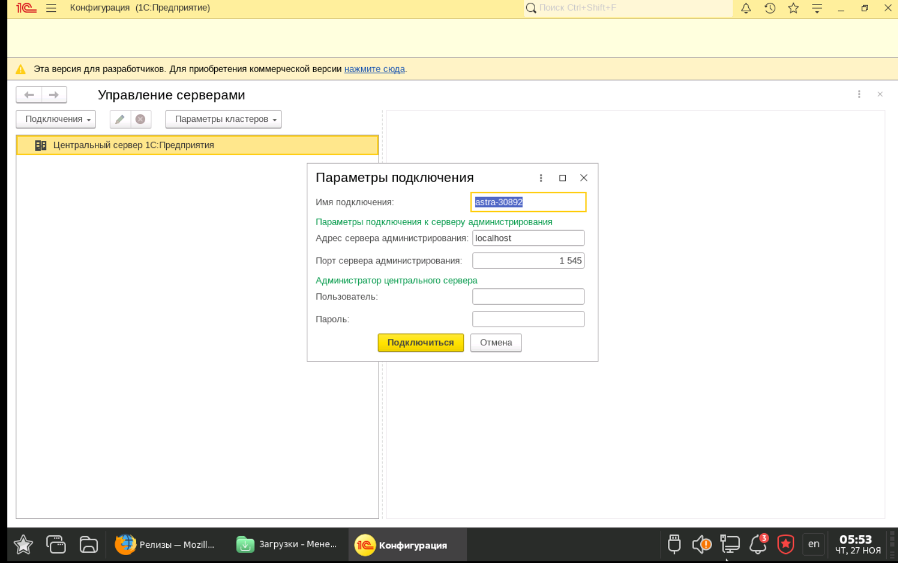

* но нужно кое-что доустановить ;


## На сервере отсутствуют шрифты из состава Microsoft Core Fonts
* при запуске базы 1С может всплывать предупреждение
```
На сервере отсутствуют шрифты из состава Microsoft Core Fonts.
Внешний вид приложения может отличаться от ожидаемого.
```
* для установки шрифтов нужно скачать и установить 3 пакета;
    * [libmspack0t64_0.11-1.1+b1_amd64.deb](./files/libmspack0t64_0.11-1.1+b1_amd64.deb)
    * [cabextract_1.11-2_amd64.deb](./files/cabextract_1.11-2_amd64.deb)
    * [ttf-mscorefonts-installer_3.8.1_all.deb](./files/ttf-mscorefonts-installer_3.8.1_all.deb)
```
sudo dpkg -i ./libmspack0t64_0.11-1.1+b1_amd64.deb
sudo dpkg -i ./cabextract_1.11-2_amd64.deb
sudo dpkg -i ./ttf-mscorefonts-installer_3.8.1_all.deb
```
* и выполнить команду;
```
sudo fc-cache –fv
```

## Установка PostgreSQL

* устанавливаем PostgreSQL;
```
wget https://repo.postgrespro.ru/1c/1c-18/keys/pgpro-repo-add.sh
sh pgpro-repo-add.sh
apt-get install postgrespro-1c-18
```

* настраиваем доступ
```
/var/lib/pgpro/1c-18/data/pg_hba.conf
```
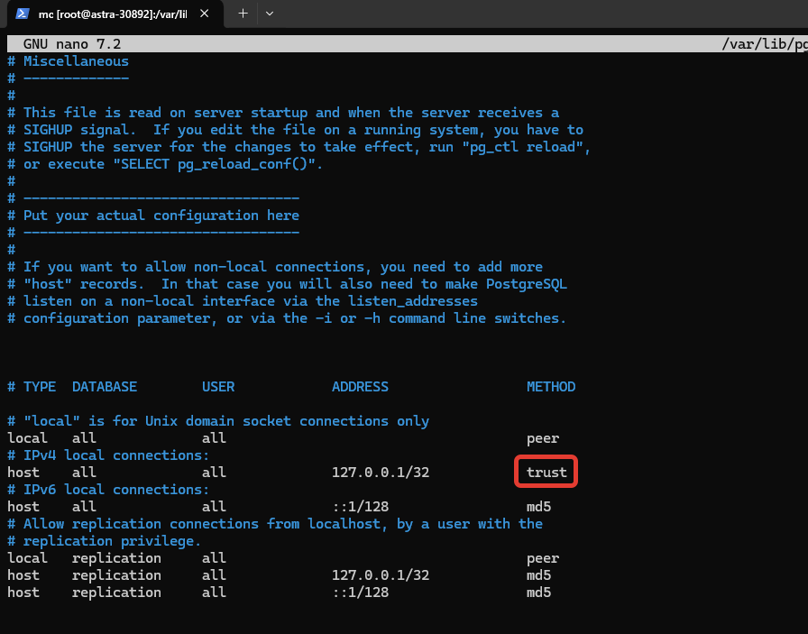

* проверяем службу;
sudo systemctl enable postgrespro-1c-18
sudo systemctl start postgrespro-1c-18
sudo systemctl status postgrespro-1c-18

* перезапускаем Астру и заходим в консоль, а не в графический интерфейс с уровнем безопасности 0;
* устанавливаем пароль postgres;
```
sudo -u postgres psql
ALTER USER postgres WITH PASSWORD 'postgres'
```

* пробуем создать базу через 1С;
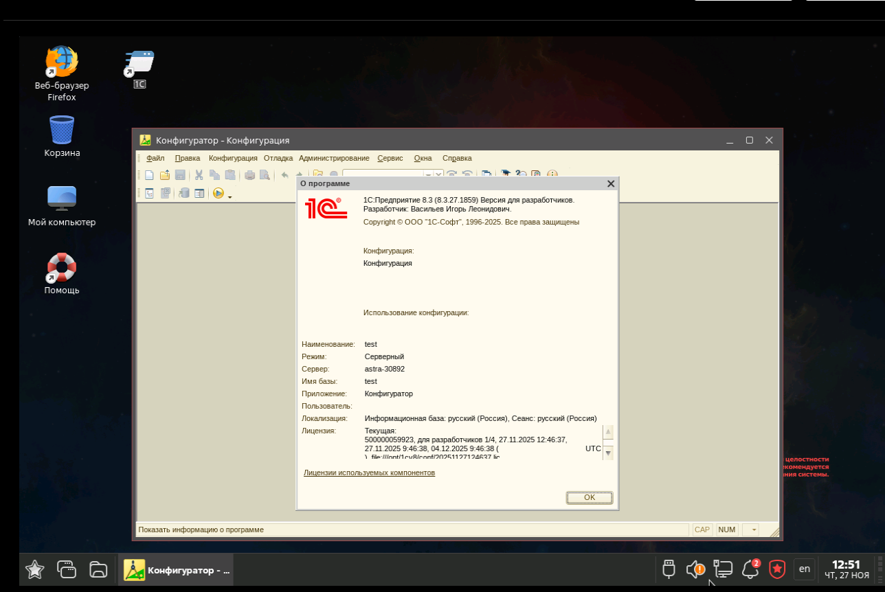

## Установка RAS для упарвления сервером 1С
* устанавливаем службу
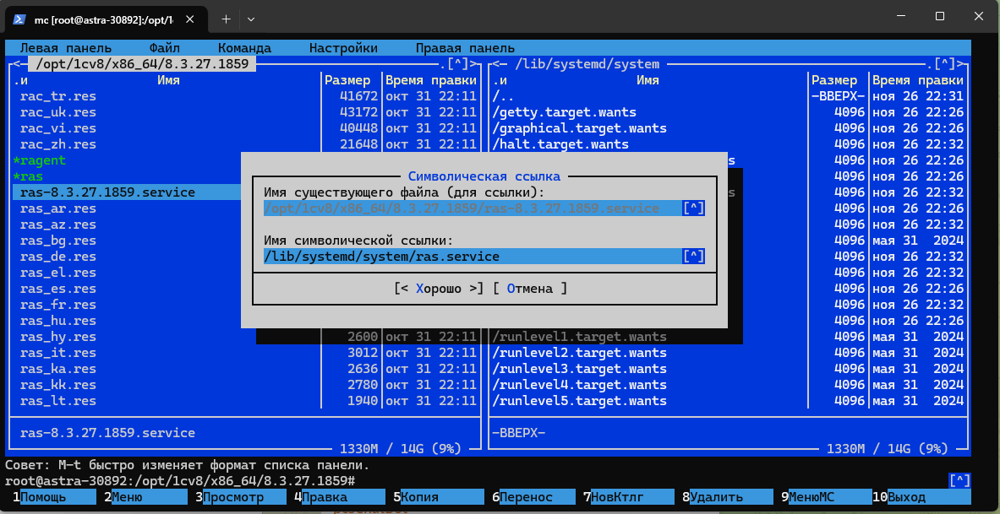

* настраиваем автозапуск и проверяем службу
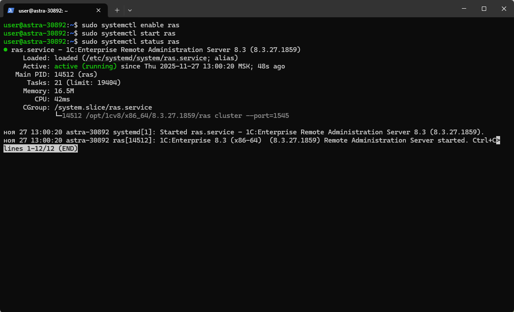

* запускаем администрировнаие и радуемся жизни;


