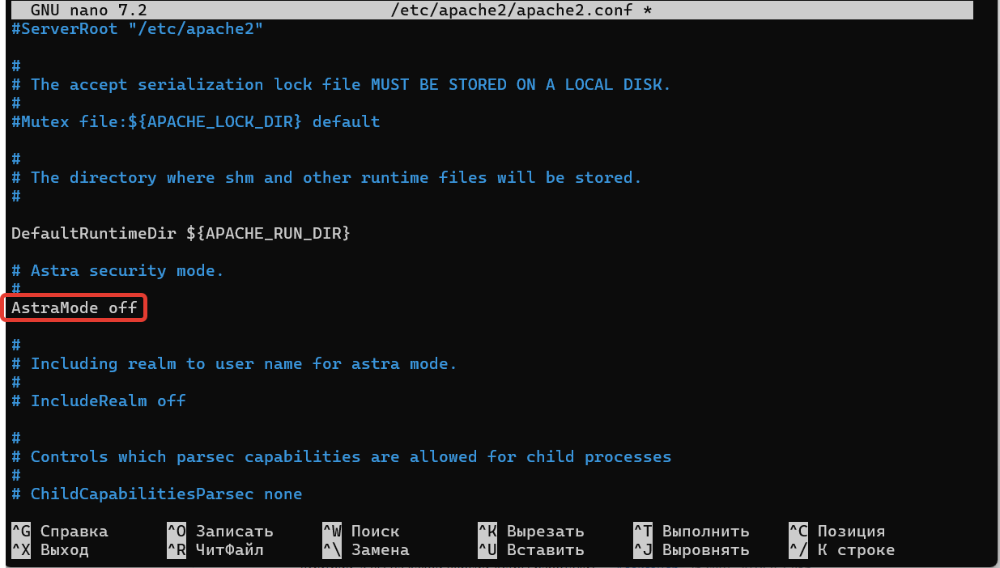

# Публикация 1С через Web-сервер Apache

* для установки Apache потребуется вставить установочный диск ОС Astra Linux 1.8


## Загрузка и монтирование ISO

* загружаем дистрибутив Астры в Астру;


* монтируем ISO
```
sudo mount -o loop -t iso9660 installation-1.8.1.6-27.06.2024_14.12.iso /media/cdrom/
```

## Установка Apache

* установка apache2
```
sudo apt install apache2
```

* проверка службы apache2
```
sudo systemctl status apache2.service
```

* отключаем аутентификацию
```
sudo nano /etc/apache2/apache2.conf
```


* перезапуск службы apache2
```
sudo systemctl restart apache2.service
```

## Публикация базы 1С

* создаем папку **/var/www/test1**, где test1 - имя базы;
* запускаем команду публиукации, где **test1** - имя базы, **astra1** - имя сервера (если не тек сервер, то указать его в /etc/hosts)
```
./webinst -publish -apache24 -wsdir test1 -dir /var/www/test1 -connstr "Srvr=astra1;Ref=test1" -confpath /etc/apache2/apache2.conf
```
* Команда публикации вносит изменения в **/etc/apache2/apache2.conf** и **/var/www/test1/default.vrd**. Если apache2 не стартует, или публикация не работает, то проверяем эти файлы и корректируем.